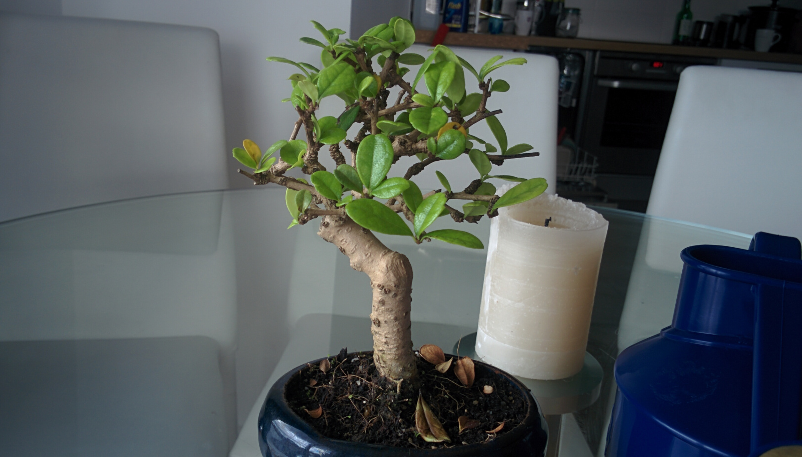

My fiance bought me a bonsai last week, and I thought it might be nice to record my progress growing it.

I've always been _really_ bad at keeping plants alive, I had a few succulents and cacti as a child, and they mostly perished. I'm trying to make a consistent effort with this tiny tree: It's far sadder to kill a plant that your wife gave you. I've read up on proper bonsai maintenance online, and It seems that I should be watering it once a day, fertilising it once a week, keeping it indoors over winter, and occasionally trimming its leaves/branches

Apparently, Bonsai need repotting once ever ~2 years, as they so rapidly deplete all the nutrition in their soil. I have read that this is best to do in early summer, so I'll be popping it out in about 6 months to check the root growth and probably upgrade it to a bigger pot.

It's had a few leaves turn yellow and drop off over the last few days. I was at first quite worried that I'd already killed it some how! However I think it might just be that Autumn is coming around and bonsais, much like normal trees, must shed their leaves.

I'll check in in a month or so with progress (or possibly to say that it's dead)
